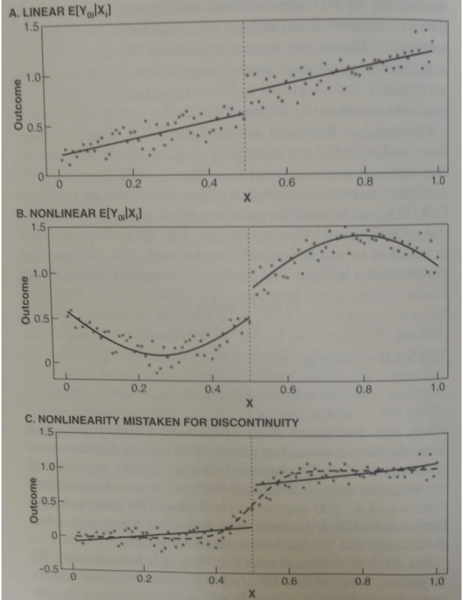

```{r setup, include=FALSE}
knitr::opts_chunk$set(echo = FALSE)
library(foreign)
library(ggplot2)
library(ggthemes)
rd <- read.dta("RDReplication.dta")
```

## Today
- Two different frameworks for understanding RD
    1) The continuity based framework (most common)
        - Relies on continuity assumptions for identification 
        - Relies on extrapolation for estimation and inference 
    2) The local randomization framework 
        - RD is a randomized experiment \textit{near} the cutoff
        - Imposes \textit{explicit} (stronger) "as good as" random assumptions 
        - But if forcing variable is discrete, may be only option
- More details on local randomization approach in:
    1) "Understanding Regression Discontinuity Designs As Observational Studies", Sekhon and Titiunik (2016) 
    2) "On Interpreting the Regression Discontinuity Design as a Local Experiment", Sekhon and Titiunik (2017) 
- **Great reference**: "\href{https://sites.google.com/a/umich.edu/titiunik/working-papers}{A Practical Introduction to Regression Discontinuity Designs: Part I}" by Cattaneo, Idrobo and Titiunik.

## Review: the (sharp) RD setup

- Some deterministic rule governs treatment $D_i$

$$ D_i= \left\{
\begin{array}{lr}
1 & : V_i \geq c \\
0 & : V_i < c \\
\end{array}
\right.$$

- Where $V_i$ is some \textit{continuous} "forcing variable" or "running variable" and $c$ is defined here as the "cutpoint."
- Unit $i$ receives the treatment iff $V_i \geq c$. 
- The AM is deterministic because once we know $V_i$, we know $D_i$.
- Treatment is "discontinuous" because treatment status is unchanged until $V_i=c$. 

## Review: the (sharp) RD setup
```{r echo=FALSE, out.width='70%', fig.align = "center"}
knitr::include_graphics('./RD_dogs.png')
```


## Review: identification

1) SUTVA: $Y_i = Y_i(1) \cdot D_i + Y_i(0) \cdot  (1 - D_i).$
2) Continuity of the CEFs of potential outcomes in $V_i$ near the cutpoint: 
\small
\[
\begin{aligned}
 \lim_{\epsilon \rightarrow 0}\E[Y_i(0) | V_i = c + \epsilon] = \lim_{\epsilon \rightarrow 0}\E[Y_i(0) | V_i = c - \epsilon] = \E[Y_i(0) | V_i = c], \\
  \lim_{\epsilon \rightarrow 0}\E[Y_i(1) | V_i = c + \epsilon] = \lim_{\epsilon \rightarrow 0}\E[Y_i(1) | V_i = c - \epsilon] = \E[Y_i(1) | V_i = c],
\end{aligned}
\]
3) Continuity of PDF of $V_i$ and positivity near the cutpoint.
\[
 \lim_{\epsilon \rightarrow 0} f(V_i = c + \epsilon) =  \lim_{\epsilon \rightarrow 0}f(V_i=c-\epsilon) > 0
\]
- As mentioned in readings and lecture, Assumption 2 -- the "continuity based assumption" (CBA) -- is crucial for identification. 

## Review: identification

- The estimand identified by the (sharp) RD is the ATE for units \textit{at the cutpoint}:
\[
\begin{aligned}
\lim_{\epsilon \rightarrow 0^+}\E[Y_i|V_i=c + \epsilon] & -  \lim_{\epsilon \rightarrow 0^-}\E[Y_i|V_i=c + \epsilon] \\
 \lim_{\epsilon \rightarrow 0^+}\E[Y_i|D_i=1, V_i=c + \epsilon] & -  \lim_{\epsilon \rightarrow 0^-}\E[Y_i|D_i=0, V_i=c + \epsilon] \\
 \lim_{\epsilon \rightarrow 0^+}\E[Y_i(1)|V_i=c + \epsilon] & -  \lim_{\epsilon \rightarrow 0^-}\E[Y_i(0)|V_i=c + \epsilon] \\
\E[Y_i(1)|V_i=c] & -  \E[Y_i(0)|V_i=c] \\
\E[\tau_i&|V_i=c]
\end{aligned}
\]

## Critical thinking about assumptions

- The CBA (continuity of potential outcome functions): do we see systematic differences in $X_i$ on either side of the cutpoint? Regress $X_i$ on $D_i$, $V_i$ and $D_i\cdot V_i$. 
    - This is frequently violated by sorting, e.g. units \textit{can decide} the precise value of $V_i$ based on their knowledge about $c$. 
    - Q: if $c$ is a known value of SAT score, is CBA violated? 
- Assumption 3 (continuity of PDF of $V_i$): do we see an unusual number of people just above/below the cutpoint? E.g. 500 people above cutpoint and 20 below. 
    - The McCrary test is one option. See the `rdd` package for implementation.
    -  The local polynomial approach via the `rddensity` function in the `rdrobust` package is better. 

## Critical thinking about assumptions
```{r, echo=FALSE}
use <- rd$Use == 1
close5 <- abs(rd$DifDPct) < 5 & !is.na(rd$DifDPct)
close10 <- abs(rd$DifDPct) < 10 & !is.na(rd$DifDPct)
dinc <- rd$DWinPrv == 1 & !is.na(rd$DWinPrv)
rinc <- rd$DWinPrv == 0 & !is.na(rd$DWinPrv)
inc.margin <- ifelse(dinc, rd$DifDPct, -rd$DifDPct)


V <- rd[rd$Use==1,]$DifDPct ## dem - repub vote share 
D <- rd[rd$Use==1,]$DemWin ## democrat wins house election in t
Y <- rd[rd$Use==1,]$DPctNxt ## democratic vote share in t+1

dat <- data.frame(Y,V,D)
dat <- dat[abs(dat$V) < 10,]

brks <- seq(-10, 10, 0.5)
ggplot(dat, aes(x = V)) + 
  geom_histogram(breaks = brks, 
                 col = "black",
                 fill = "grey") + 
  stat_bin(aes(y=..count.., label=..count..), geom="text", vjust=-.5,
           breaks = brks) +
   geom_vline(xintercept = 0, col = 'black', lty = 1, lwd = 1) + 
  xlab("Democratic Party Margin (%)") + 
  ylab("Frequency Count in 0.5% Bins") + 
  ggtitle("Histogram of Democratic party's margin near the cut-point") + 
  theme_tufte(base_size = 18)
```
     
## Critical thinking about assumptions

```{r}
dems <- rd$DifDPct[close5 & use & dinc]
repubs <- rd$DifDPct[close5 & use & rinc]

plot_df <- 
  data.frame(outcome = c(dems, repubs), 
             party = c(rep("Democrat-Held Seats", length(dems)), 
                       rep("Republican-Held Seats", length(repubs))))
brks <- seq(-5, 5, 0.5)
ggplot(plot_df, aes(x = outcome)) + 
  geom_histogram(breaks=brks,
                 col = "black",
                 fill = "grey") + 
  stat_bin(aes(y=..count.., label=..count..), geom="text", vjust=-.5,
           breaks = brks)  + 
  geom_vline(xintercept = 0, col = 'black', lty = 1, lwd = 1) + 
  facet_wrap(~ party) + 
  xlab("Democratic Margin (%)") + 
  ylab("Frequency Count in 0.5% Bins") + 
  ggtitle("Histogram of Democratic Margin t in the neighborhood of the cut-point, \n broken down by incumbent party") + 
  theme_tufte(base_size = 18)
```

## Critical thinking about assumptions

```{r, echo = FALSE}
plot_df <- data.frame(outcome = inc.margin[close10 & use])
brks <- seq(-10, 10, 0.5)

ggplot(plot_df, aes(x = outcome)) + 
  geom_histogram(breaks = brks, 
                 col = "black",
                 fill = "grey") + 
  stat_bin(aes(y=..count.., label=..count..), geom="text", vjust=-.5,
           breaks = brks)  + 
  geom_vline(xintercept = 0, col = 'black', lty = 1, lwd = 1) + 
  xlab("Incumbent Party Margin (%)") + 
  ylab("Frequency Count in 0.5% Bins") + 
  ggtitle("Incumbent party's margin in U.S. House elections") + 
  theme_tufte(base_size = 18)
```


## Estimation
- In general, there are no observations where $V_i = c$. Why? 
    - For a r.v. $X$ w/ a truly continuous PDF, $\text{Pr}(X=x) = 0$ 
- How many observations are "near" the cutpoint? 
    - Depends on how we define "near"
- Key issue: RD depends crucially on extrapolation for estimation, atleast in some neighborhood near the cutpoint
    - Approximating $\E[Y_i(1)|V_i=c]$, $\E[Y_i(0)|V_i=c]$ in practice relies on the observations "near"" $c$

## Estimation
From Mostly Harmless (p. 254):

```{r, echo = FALSE, out.width = '8in', fig.align="center"}

```


## Estimation
- **Weierstrass approximation theorem**: every continuous function on a closed interval, e.g. $[c-h, c+h]$ can be uniformly approximated as closely as desired by a polynomial function
    - Problem: RD treatment effects are defined at boundry points and global approximations do a bad job here (**Runge's phenomenon**)
    - Solution (from analysis): convolve the function we want to approximate via a polynomial kernel
    - Implementation: use polynomial approximation with kernel for weighting observations in $[c-h, c+h]$

## Estimation
- A local-polynomial recipe:
    1) Choose a polynomial order $p$ and a kernel function $K(\cdot)$
    2) Choose a bandwidth $h$
    3) For $V_i \geq c$, regress $Y_i$ on $(V_i-c), \ (V_i-c)^2,\dots, (V_i-c)^p$ via WLS with weight $K\left(\frac{v_i-c}{h}\right)$. 
    4) For $V_i < c$, regress $Y_i$ on $(V_i-c), \ (V_i-c)^2,\dots, (V_i-c)^p$ via WLS with weight $K\left(\frac{v_i-c}{h}\right)$
    5) Sharp RD point estimate in the intercept in 3) minus the intercept in 4)
- Researcher degrees of freedom: $K(\cdot)$, $p$, and $h$
    - People often recommend weighting observations closer to the cutoff more heavily; hence a triangular kernel 
    - A trade-off exists between $p$ and $h$ 
    - Imbens and Kalyanaraman (2012) propose a method for choosing bandwidth that is (asymptotically) MSE-optimal
- None of this has **anything** to do with identification 

## Summary of continuity based framework

- Key identification assumption: continuity of CEFs of potential outcomes in $V_i$ near $c$ (the "CBA") 
- Under random assignment we shouldn't see differences in pretreatment characteristics on either side of the cutpoint
    - We can't test continuity directly (potential outcomes are unobservable)
    - We can test a stronger version: continuity of the CEFs of potential outcomes **and** a background covariate
    - Failure to find evidence of differences **does not** imply continuity
- We also shouldn't see an unusual number of units on either side of the cutpoint
    - We have a direct test of Assumption 3 (continuity of PDF of $V_i$ at $c$)
    - The null is that there is no discontinuity in $f(V_i)$, e.g.  $\lim_{\epsilon \rightarrow 0^+}f(V_i=c + \epsilon) = \lim_{\epsilon \rightarrow 0^+}f(V_i= c+ \epsilon)$
    - McCrary test (`rdd`) or a local polynomial approach (`rdrobust`) 

## Summary of continuity based framework  
- Assumption checks are important, but hard to implement. Why? 
    - The estimand is defined by a measure zero event, e.g. a continuous variable taking on a specific value $c$ 
    - Unlike in experiment, covariate balance is only implied at the cut-point 
- Estimation of RD hinges crucially on extrapolation, so we have to think carefully about functional form
    - As Fredrik explained in lecture, estimation can be a nightmare
    - A smoother functional form requires more data, but we are also pruning units that aren't "near" the cutpoint!
    - Bandwidth selection and so on has nothing to do with identification

## Local randomization framework
- Treatment is "as if" randomly assigned in some neighborhood around the cutoff
- Units with $V_i$ in some "small" window around $c$ are "as if" randomly assigned to treatment or control
- Formally, in some neighborhood $W\in[c-w, c+w]$ for $w>0$
    - Assume \small $Y_i(1), Y_i(0) \ \indep \ D_i \ | \ V_i \in W$
    - Then \footnotesize $$\E[Y_i(1) - Y_i(0)|V_i\in W] = \E[Y_i|D_i=1,V_i\in W]-\E[Y_i|D_i=0,V_i\in W]$$ 
- Identification is based on this "Local Randomization Assumption" (LRA), rather than continuity
    - Target parameter is the ATE inside $W$ rather than the ATE at $c$
    - Estimation is not concerned w/ approximating $\E[Y_i(1)|V_i]$ and $\E[Y_i(0)|V_i]$ 

## Local randomization framework   
- LRA is **not** part of what is required in the continuity based case
    - Indeed, it's typically not plausible 
    - Units with higher scores on $V_i$ are generally systematically different from those with lower scores 
- LRA implies a LATE, so invokes an exclusion restriction assumption for sharp RD 
    - Namely, inside $W$, $D_i =  D_i(1)V_i + D_i(0)(1-V_i)$
    - Thus, $V_i$ is excluded from $Y_i=Y_i(1)D_i + Y_i(0)(1-D_i)$
- Other problems: 
    - How do we know what $W$ is supposed to be?
    - Methods for estimation and inference assume $W$ is fixed as $n\to\infty$

## Sekhon and Titiunik (2016)
- A conceptual critique of the local randomization approach.
- Misconception that treatment assignment rule in RD designs is "as good as" an RCT near the cutoff. 
- RD is an **observational study**, but they are often not interpreted as such.
- But observational studies are often defined by not knowing AM, and in RD we know it!    
- Key issues: 
    - Distribution of $V_i$ is fundamentally unknown
    - Unlike in experiment, knowing a (deterministic) AM in the RD design is not enough. Why?
        - AM determines $D_i$, but not $V_i$! 
    - $V_i$ is often an important determinant of potential outcomes 
    - $V_i$ may have a **direct effect** on potential outcomes

## Sekhon and Titiunik (2017)

- A more formal critique of the local randomization approach
- Key points:
    - Continuity of the CEFs of potential outcomes in $V_i$ does not imply LRA
    - LRA does not imply $D_i$ and $Y_i(0), Y_i(1)$ are independent 
    - LRA does not imply $V_i$ and $Y_i(0), Y_i(1)$ are independent
    - Assuming **local independence** between $Y_i(0), Y_i(1)$ and $D_i$ does not imply $V_i$ only affects $Y_i$ through $D_i$ (exclusion restriction)

## Sekhon and Titiunik (2017)

- Paper shows:
    - Even if we randomize $V_i$ inside $W$, the LRA is not guaranteed to hold!
    - If (randomly assigned) $V_i$ not independent of potential outcomes, treatment may fail to be independent of potential outcomes 
    - Why? $D_i$ is a (deterministic) function of $V_i$. LRA does not imply exclusion restriction 
- Conclusions: 
    - If exclusion restriction fails, we can still capture some re-paramaterized causal effect like an ITT
    - This is the effect of obtaining $V_i \in [c, c + w]$ versus $V_i \in [c-w,c)$
    - Appealing because it seems to avoid estimation and inference issues of continuity based framework
    - However! It requires additional assumptions that are hard to swallow 

## The End
```{r echo=FALSE, out.width='70%', fig.align = "center"}
knitr::include_graphics('./RD_dogs.png')
```


